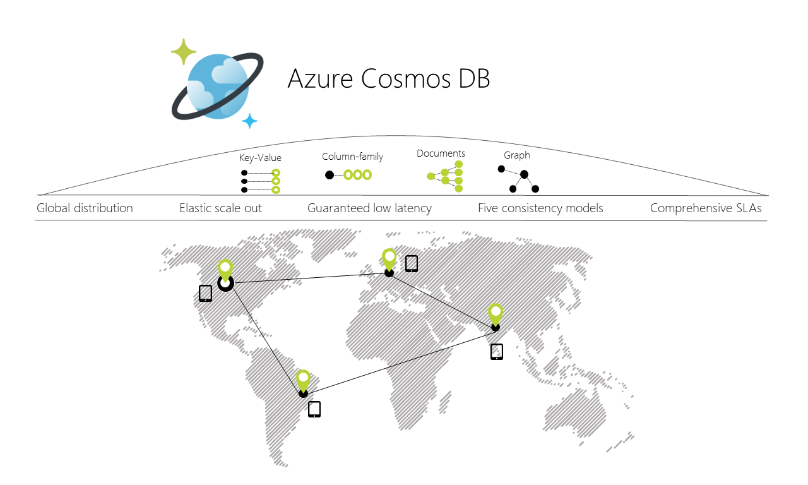

# azure-cosmosdb-workshop

"CosmosDB-in-a-Day"

---

# Agenda

### Overview

- [What is NoSQL?](what-is-nosql.md)
- [What is CosmosDB?](what-is-cosmosdb.md)

### Examples

- [SQL API](sql-api-demo.md)
- [Gremlin API - The Six Degrees of Kevin Bacon](gremlin-graph-demo.md)

### More Examples

- [Port a MongoDB database to CosmosDB](mongo-to-cosmosdb-demo.md)
- [Cassandra API](cassandra-api-demo.md)
