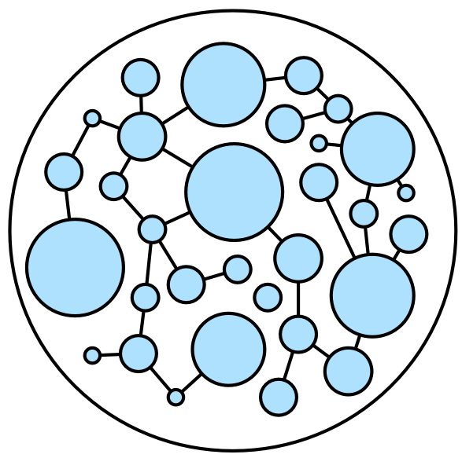

# Azure CosmosDB - Graph/Gremlin API Demo

## Gremlin Concepts - Edges and Vertices, Query Language



---


### Add a Vertex

```
:> g.addV('person')
    .property('id', 'thomas.1')
    .property('firstName', 'Thomas')
    .property('lastName', 'Andersen')
    .property('age', 44)
```

### Add an Edge between two Vertices

```
:> g.V('thomas.1').addE('knows').to(g.V('robin.1'))
```

See https://docs.microsoft.com/en-us/azure/cosmos-db/gremlin-support

---

## The Six Degrees of Kevin Bacon Demo

See https://github.com/cjoakim/azure-cosmosdb-graph-node
